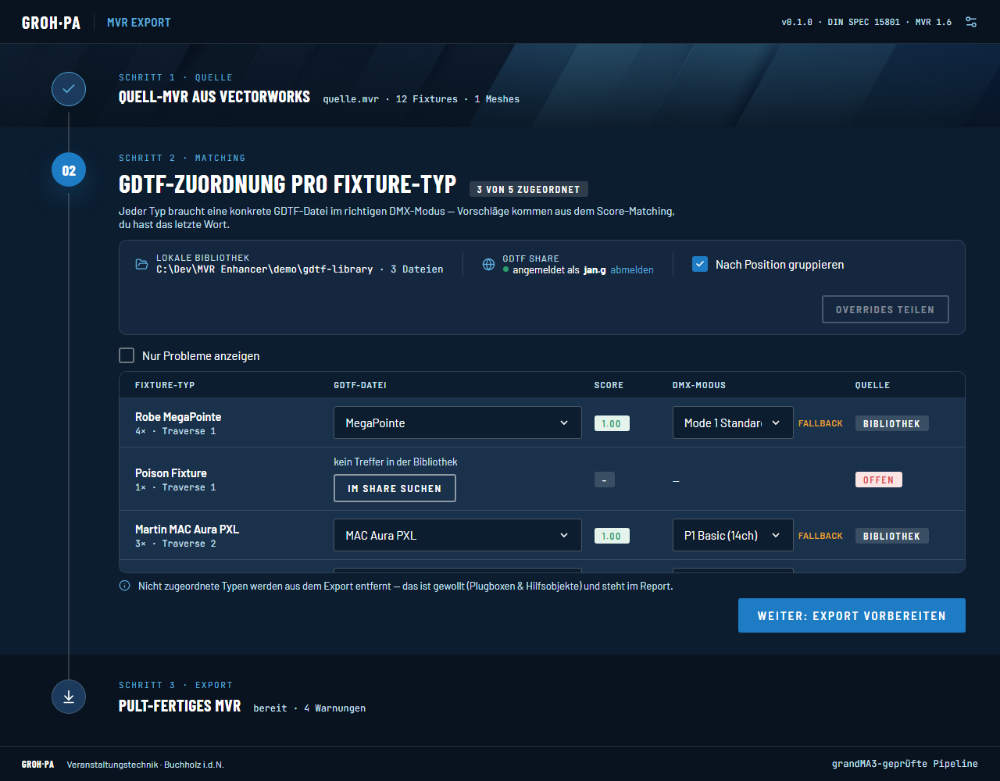

# MVR Enhancer

Windows-Desktop-App, die ein aus Vectorworks exportiertes MVR pro Fixture-Typ mit GDTF-Datei und DMX-Modus anreichert und als bereinigtes, grandMA3-sicheres MVR exportiert.



## Was es macht

Der Workflow läuft in drei Schritten, die du als Akkordeon durchgehst:

1. **Quelle** — MVR-Datei auf die Ablagefläche ziehen oder klicken, um sie per Dateidialog zu wählen (alternativ aus der Zuletzt-Liste). Während des Ladens zeigt die Ablagefläche einen kurzen Fortschrittsbalken. Du siehst Datei-Kennzahlen (Fixtures, Fixture-Typen, 3D-Meshes, Positionen) und eine kurze Sicherheitsprüfung.
2. **Matching** — jeder Fixture-Typ bekommt score-basierte GDTF-Vorschläge aus deiner lokalen Bibliothek und (optional) GDTF Share. Du wählst pro Typ die passende GDTF-Datei und den DMX-Modus — oder entfernst den Typ ganz aus dem Export. Du hast immer das letzte Wort. In der Quellen-Leiste stellst du außerdem den Export-Modus ein (siehe [Export-Modi](#export-modi)).
3. **Export** — vor dem Export siehst du offene Warnungen (fehlende Zuordnungen, Modus-Fallbacks, Adress-Kollisionen) und eine Vorschau der Bereinigung. Der Export schreibt ein neues MVR: Gift-Elemente (`CustomCommands`, `Position`) entfernt, verwaiste GDTFs ausgeschlossen, Layer nach Position neu organisiert.

## Export-Modi

In der Quellen-Leiste von Schritt 2 schaltest du zwischen zwei Modi um:

- **Single Layer** (Standard) — alles landet in einem Layer „MVR Enhancer Export": die Fixtures (optional nach Position gruppiert) plus eine „3D"-Gruppe mit allen 3D-Objekten der Szene.
- **Per Layer** — die Fixtures liegen weiterhin im Layer „MVR Enhancer Export"; zusätzlich bleibt jeder Original-Layer der Quell-MVR erhalten, der 3D-Objekte enthält, und bekommt darin eine eigene „3D"-Gruppe (erscheint in grandMA3 als Grouping-Fixture). Original-Layer ohne 3D-Objekte entfallen.

## Download & Nutzung

1. Lade `MVR Enhancer.exe` von den [GitHub Releases](https://github.com/Harlekin7/mvr-enhancer/releases) herunter.
2. Kein Installer nötig — einfach doppelklicken.
3. Voraussetzung: die **WebView2-Runtime**. Auf Windows 11 ist sie vorinstalliert. Auf Windows 10 ggf. den [Evergreen-Runtime-Installer von Microsoft](https://developer.microsoft.com/microsoft-edge/webview2/) nachinstallieren.

## GDTF-Bibliothek & GDTF Share

- In der Quellen-Leiste (Schritt 2) wählst du einen lokalen Ordner mit GDTF-Dateien als Bibliothek. Der Ordner wird gescannt, die Fixtures stehen danach als Score-Vorschläge zur Verfügung.
- Optional kannst du dich mit deinem [GDTF Share](https://www.gdtf-share.com/)-Account anmelden, um fehlende Fixtures direkt zu suchen und in deine Bibliothek zu laden — ohne den Umweg über den Browser.

## Bekannte Grenzen (v0.2.0)

- Fixtures mit mehreren DMX-Breaks werden aktuell als Single-Break gelesen — die Adress-Kollisionsprüfung kann Kollisionen dadurch unterschätzen.
- Ein Footprint, der über eine 512-Kanal-Universumsgrenze reicht, wird vollständig dem Start-Universum zugerechnet.
- Ein Modus mit 0 Kanälen deaktiviert die Kollisionsprüfung für diesen Typ.
- Bei Überschreiten der ZIP-Schutzlimits wird die Szene gekürzt (Schutz vor manipulierten Dateien).
- Ein MVR-Import kann vorhandene grandMA3-Show-Layer nicht löschen — leere Layer in einer bestehenden Show stammen aus früheren Importen und müssen dort manuell entfernt werden.
- Backlog (noch nicht enthalten): Detailansicht der Adress-Kollision. („Overrides teilen" und „Diff zum letzten Export" sind bewusst gestrichen.)

## Entwicklung

Python 3.12, Windows.

```powershell
python -m venv .venv
.venv\Scripts\pip install -e .[dev]

# Tests
pytest -q

# Lint
ruff check .

# App starten (aus dem venv)
python -m mvr_enhancer

# .exe bauen (Ausgabe: dist/MVR Enhancer.exe)
tools/build_exe.ps1
```

Architektur- und Design-Details: [`docs/superpowers/specs/2026-08-05-mvr-enhancer-design.md`](docs/superpowers/specs/2026-08-05-mvr-enhancer-design.md), Abgleich UI ↔ Prototyp: [`docs/design-review.md`](docs/design-review.md).

## Lizenz/Hinweise

- Die Nutzung von GDTF Share unterliegt den Bedingungen von [gdtf-share.com](https://www.gdtf-share.com/).
- Lokal gebündelt: die Schriften Barlow und JetBrains Mono (SIL Open Font License) sowie Lucide-Icons (ISC-Lizenz).
- Die Wordmark „GROH·PA" ist ein Platzhalter — es existiert kein offizielles Logo.
